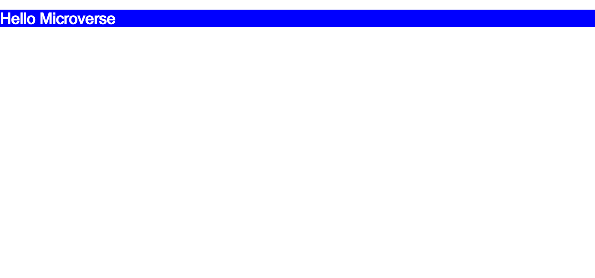

Abdulrahman's website

Simple website with text

Simple website

## Learning Objectives

- Create branches with different base branches.
- Understand the concept of version control.
- Follow Gitflow.
- Open pull requests in GitHub.
- Write descriptive, easy to understand commit messages.
- Write short, detailed, easy to understand descriptions of pull requests.
- Write a descriptive and easy to understand README in business English for every project submitted.
- Demonstrate an ability to submit a project for code review.

## Built With

- HTML
- CSS
- HTML Linters
- CSS Linters

## Authors

👤 Abdulrahman Shrshar

- GitHub: [@githubhandle](https://github.com/abdulrahmanshr75)
- LinkedIn: [LinkedIn](https://www.linkedin.com/in/abdulrahman-shrshar-721144161/)

## 📝 License

This project is [MIT](./MIT.md) licensed.
